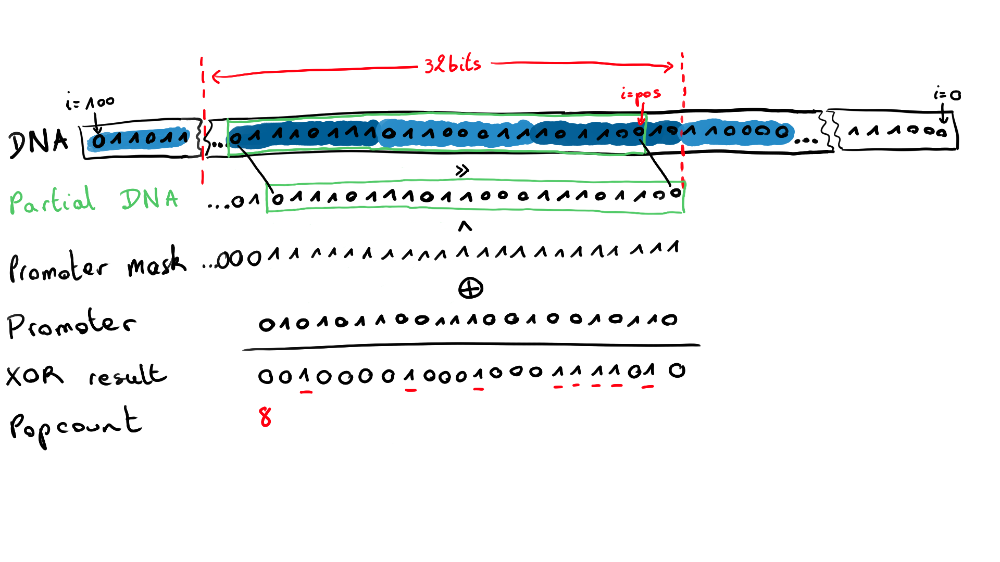

```{r setup, include=FALSE}
knitr::opts_chunk$set(echo = TRUE, warning = FALSE, message = FALSE, fig.width = 10, fig.height = 5)
library(ggplot2)
library(reticulate)
library(kableExtra)
library("data.table")
library("pander")
library(scales)
library(png)
library(knitr)
```

\newpage

# Introduction

During this project our goal will be to optimize the execution of micro-aevol, a biological simulator. The program performs mutations on a DNA sequence and compute the phenotype of each organism and perform an evolution process by computing the fitness of each individual and reproducing the best ones.

# Presentation of the program

Micro Aevol is built to simulate a biological evolution of organisms to find the best approximation of a given function using an approximation of the phenotype using triangles areas. The triangles sizes and positions are determined from the genes found in the RNA, some of the best fitting organisms (difference to the ideal Gaussian curve being minimal) will be selected to be reproduced for the next generation, sometimes with DNA mutation. 

On execution, the program have various options that can be modified :

- width / height: The colony size to add to or reduce the number of organisms; 
- nbsteps: how many generations of organism will succeed the first one;
- genome size: The size of the DNA sequence;
- mutation rate: an equivalent of the probability of having mutations;
- seed: the seed for the random number generation;
As the program runs, it saves each generations in a backup file, that way the program can start at any point in an already calculated evolution. When the code run two times with the same options, the result will be the same.

The main part of the code is reading DNA and translating it to the phenotype through different steps. First we locate each sequence of 22 bits in the DNA having at most 4 differences with a sequence called promoter. For each promoter, the DNA will be read again to find a sequence called a terminator, and the DNA between the two corresponds to an RNA sequence. The program then look for the Shine-Dalgarno sequence, which corresponds to the fixation point for the ribosome to start translating the RNA into a protein.  Each protein is defined by three attributes: M will determine the position of triangle, W the base, and H the height. The height will also be weighted depending on the difference seen before between the promoter of our RNA and a correct promoter.

Once every triangles are found for an organism, the code sums them to have a figure called the phenotype, and the last operation is to compute the fitness of this figure, comparing it with the model. Fitness correspond to a bijection between 0 and 1 of the meta-error, the absolute difference between each sample of the phenotype curve and the gaussian ideal curve. Organisms having the best fitness are granted a better chance to stay for the next generation during the selection. Each organism might be replaced by one of its neighbour in the organism grid. Once done, each organism have a chance to get one or many mutation of their DNA, corresponding to a bit flip. And the loop can start again.

# Experimental process

In our analysis we will mainly focus on optimizing the program on CPU. Our criteria for optimizing the program is focused on the execution time of the program as a whole, without considerations for memory usage or cumulated execution time on each CPU core. For optimizing the program on CPU, we will be using OpenMP as a way to vectorize and parallelise the code, and we will also modify the sources to optimize the data structures and algorithms. The performance will be measured using both Intel V-Tune 2021.9.0 and timers embedded inside the program itself using the clock from the standard library of C++ Note that the embedded timers will be disabled when measuring with Intel V-Tune to prevent any additionnal overhead in execution time due to timers. Those will only be used when focusing on a specific segment of code. Each execution will use the same random seed for its RNGs.

We also worked on finding the hotspots during program's execution under CUDA with Nvidia Nsight, but had little to no time to optimize it further using CUDA's specificities. 
After each modification of the program's source code, we ensure that no regression is introduced by comparing the backup file of the program generated at the end of the execution using the UNIX diff tool.
Each measurement was performed on a personal laptop with a `Intel(R) Core(TM) i7-10510U CPU @ 1.80GHz` with 4 cores, 8 threads, and 8MB of cache. Note that our measurements are subject to variations due to other programs running in the background on our personal laptops.

\newpage

# Optimizations

## Compilation settings

The first optimization is also the easiest one to perform, we will evaluate the impact of the compiler and compilation flags on the execution time. Each binary will be compiled in release mode using cmake. The C++ compiler is changed by setting the CXX path to use GCC, Clang++ or DPC++ (intel compiler).

Each compilation flag is tested separately. We will evaluate the execution time by using the `timeit` module in Python, and retrieving the median value for 10 executions. This will mitigate any scattered time values.

```python
import timeit
import numpy as np

reps = timeit.repeat(repeat=10, number=1, setup="import subprocess as sp;",
                                          stmt="sp.call('./micro_aevol_cpu')")
median = np.median(reps)
print(median)
```

We will test the different optimizations levels provided by the compilers, including `-O1`, `-O2`, `-O3` but also `-march=native` to generate instructions specific to our processor.

```{r, echo=FALSE}
data_frame <- data.frame(None = c("8.73s", "10.49s", "3.39s"),
                         o1 = c("5.39s", "3.20s", "5.38s"),
                         o2 = c("3.32s", "3.30s", "3.01s"),
                         o3 = c("3.16s", "2.68s", "2.98s"),
                         archnative = c("9.09s", "9.82s", "3.02s"),
                         row.names = c("clang++ 10.0.0-4ubuntu1", "gcc 9.3.0-17ubuntu1", "dpc++ 2021.4.0"))

setnames(data_frame, c("none", "-O1", "-O2", "-O3", "-march=native"))
pander::pander(data_frame)
```
Without any optimizations enabled, the Intel compiler produces the fastest code of all, with 3.39s of execution against 8.73s for clang++ or 10.79s for GCC. When comparing the execution times of programs compiled with the different optimizations levels, it looks like GCC is almost in first position (when taking the uncertainty factor into account). However, the Intel Compiler appears to provide a better solution when compiling for our processor with a speedup factor of more than around 3 compared to other compilers.

For the rest of this analysis, GCC will be used.


## Parallelization of individual's mutation and evaluation

In the evolution process, we noticed that the mutation and evaluation of each individual is inter-independent. Therefore, parallelizing this loop is pretty straightforward using OpenMP as this can be done by adding `#pragma omp parallel for` before the for loop instruction. However, we can optimize the scheduler to better balance the repartition of operations on the different cores. For this, we need to know the best option between `static`, `dynamic`, `guided`, `auto` or `runtime`.
In order to take the best-fitting decision, we can measure the execution time of each iteration of the loop, and draw a density function. The experiment was made on a 32x32 grid (1024 individuals) on 1000 generations, so n=1024000, resulting in the following density function:

```{r, echo=FALSE}
df <- read.csv(file="exec_time_single_individual.csv", head = TRUE)
p <- ggplot(df, aes(x=exec_time)) + geom_density() + labs(x="Execution time (ms)", y="Density", title="Density function of the individuals loop execution time (in ms)") + xlim(0, 0.008)
p
```

We can also extract the quantiles to better analyze the curve:

```{r, echo=FALSE}
pander::pander(quantile(df$exec_time))
```

In this case, we can clearly see a two major spikes around at 0.001ms and 0.002ms, with 50% of the values included in the interval [0.001ms; 0.002ms]. As the difference is very small, we can consider the execution time of each iteration as constant. This makes us choose the static scheduler over the dynamic one. We can validate our hypothesis by comparing the execution time when using the static vs dynamic scheduler.

Over 1000 generations on 4 threads, we get the following results (for static and dynamic scheduling respectively):

```{r, echo=FALSE}
df1 <- read.csv(file="exec_time_static_4_threads.csv", head = TRUE)
pander::pander(quantile(df1$exec_time))
```
```{r, echo=FALSE}
df2 <- read.csv(file="exec_time_dynamic_4_threads.csv", head = TRUE)
pander::pander(quantile(df2$exec_time))
```
We can see that the median execution time for the dynamic scheduling is 5ms more than the execution time for the static one. This consolidates our choice of static scheduling.

The main advantage of this parallelization is that, in theory, the execution time of the individuals update is divided by the number of physical cores used. We can evaluate the speedup factor by performing strong and weak scaling.

```{r, echo=FALSE}
df1 <- read.csv(file="strong_scaling_1thread.csv", head = TRUE)
df2 <- read.csv(file="strong_scaling_2thread.csv", head = TRUE)
df3 <- read.csv(file="strong_scaling_3thread.csv", head = TRUE)
df4 <- read.csv(file="strong_scaling_4thread.csv", head = TRUE)

data <- rbind(
  data.frame(n_threads="1", exec_time=median(df1$exec_time), total_time=df1$total[1]),
  data.frame(n_threads="2", exec_time=median(df2$exec_time), total_time=df2$total[1]),
  data.frame(n_threads="3", exec_time=median(df3$exec_time), total_time=df3$total[1]),
  data.frame(n_threads="4", exec_time=median(df4$exec_time), total_time=df4$total[1])
)

ggplot(data=data, aes(x=n_threads, y=total_time)) + geom_bar(stat="identity", position=position_dodge()) + labs(x="Number of threads (N)", y="Total execution time (s)", title="Total execution time (in s) relatively to the number of threads")
ggplot(data=data, aes(x=n_threads, y=exec_time)) + geom_bar(stat="identity", position=position_dodge()) + labs(x="Number of threads (N)", y="Individuals update loop execution time (ms)", title="Individuals update loop execution time (in ms) relatively to the number of threads")
```
We observe that the total execution time is decreasing with the number of threads as expected, but the relation is not linear. Moreover, if we take a look at the individuals update loop execution time, we can see that there is an overhead that might be coming from the creation of the threads.
Using Amdahl's law, we can compute the speedup for each number of threads. Amdahl's law is described by the formula written below, where s is the proportion of execution time spent on the serial part, p is the proportion of execution time spent on the parallelized part and N is the number of threads.

$$speedup = \frac{1}{s+\frac{p}{N}}$$
We can compute s and p with our experimental values like so $p=\frac{\sum{individualLoopExecTime}}{totalExecTime}$ and $s = {1 - p}$.

```{r, echo=FALSE}
speedup <- function(df, N) {
   p = (sum(df$exec_time)/1000)/df$total[1]
   s = (1 - p)
   format(1/(s+p/N), digits = 4)
}

data <- rbind(
  data.frame(n_threads="1", s=speedup(df1, 1)),
  data.frame(n_threads="2", s=speedup(df2, 2)),
  data.frame(n_threads="3", s=speedup(df3, 3)),
  data.frame(n_threads="4", s=speedup(df4, 4))
)

ggplot(data=data, aes(x=n_threads, y=s)) + geom_bar(stat="identity", position=position_dodge()) + labs(x="Number of threads (N)", y="Speedup", title="Amdahl's law speedup relatively to the number of threads") + geom_text(aes(label=s), position = position_dodge(width=1), vjust=-0.5)
```
Using 4 threads is the optimal solution here, as the speedup factor is closer to the number of threads.

## Data structure and algorithms optimizations

When profiling the program's execution using Intel V-Tune, we quickly noticed that most of the time is spent inside the functions `terminator_at` and `promoter_at` which are both used when looking for a promoter or a terminator on the DNA sequence.

The original program is using a vector of characters to store the DNA, composed of 1 and 0. This method is not memory-efficient as we can't use all the 8 bits of the character to store the DNA. A better option is to create a bitset data structure to fully use the bits of one byte. By doing so, we reduce the memory consumption by a factor of 8.

The creation of our bitset is as simple as creating a `std::vector` of `uint8_t`, we need $N=\lceil\frac{dnaSize}{8}\rceil$ bytes to store all the DNA. To this, we will add a mirror at the end of the sequence that will be the same 22 bits that are present at the beginning of the DNA. This will prevent any use of the modulo operation, and also simplify the algorithm. The final size of the bitset will be $N=\lceil\frac{dnaSize+22}{8}\rceil$ bytes.

### Promoter pattern matching

When looking for promoters, the original algorithm used a naïve approach. It consists of two nested loop, with the first one iterating over the DNA, and the second one comparing the 22 characters of the promoter sequence to the DNA at the given position. This results in a $$O(n*m)$$ complexity, where n is the size of the DNA sequence, and m is the size of the promoter sequence.

By using a bitset representation of the DNA, we can make the second loop (the comparison), a $$O(1)$$ operation by using the XOR operation. It has the advantage to leverage the hardware to perform a very quick operation when comparing the 22 bits of our promoter sequence.

The illustration below explains the algorithm for the `promoter_at` new function:

- First, we iterate over the positions of the DNA.
- For each position of the DNA, we retrieve 4 bytes in the bytes vector. Starting with the byte at position $firstBytePos=\lfloor\frac{pos}{8}\rfloor$. As we store the bytes in a vector, the contiguity allows us to access the 32 bits directly without extra-cost.
- We shift the resulting 32 bits to align the bit at position `pos` in memory.
- We apply a mask to only keep the 22 bits of DNA we will compare.
- We apply a 32 bits XOR between the masked partial DNA sequence and the promoter sequence.
- We use the builtin popcount function to count the number of bits set to 1. This corresponds to our Hamming distance.

```{r  out.width = "100%", echo=FALSE}
 
```
The overall complexity of this algorithm is reduced to $O(n)$ as the XOR and popcount have a $O(1)$ complexity. This gives us a very good performance speedup.

In a nutshell, the new algorithm for `promoter_at` can be written like so:

```cpp
int Dna::promoter_at(int pos)
{
    size_t byte_idx = pos / 8;
    size_t bit_idx = pos % 8;

    // Retrieve 4 bytes of DNA including the 22 bits that interests us
    uint32_t dna_partial = *(uint32_t *)(seq_.data() + byte_idx);

    // Chop chop the DNA to 22 bits and calculate its Hamming distance to the
    // promoter sequence:
    // - First we aligning the bit that interests us (the bit at position `pos`
    //   in the DNA) on the right hand side of our 4 bytes.
    // - Then we only keeping the 22 least significant bits so that we can easily
    //   compute the Hamming distance to the promoter sequence.
    uint32_t dna_to_cmp = (dna_partial >> bit_idx) & PROM_MASK;

    return __builtin_popcount(dna_to_cmp ^ PROM_SEQ);
}
```

Overall, this optimization allowed us to reduce the time spent in the `promoter_at` by a factor of around 90. For example, on a 32x32 grid, with 4 cores used for the individuals parallelized loop, we had 1.89s spent in the `promoter_at` function, against 0.020s with our method.

To go even further, we could declare the promoter_at function as a SIMD function using `#pragma omp declare simd` and adding `#pragma omp simd` over the DNA iterating loop. But in our case, the builtin popcount function was not vectorizable, so this couldn't be used in that case. Moreover, to use vectorization efficiently, we would need to spend extra-time on managing the memory layout of the program to have the promoter sequence right next to the DNA sequence in memory, but as the DNA can be quite large, it would also mean that we should copy a partial representation in memory to keep it short enough to fit in the cache next to the promoter sequence... Other solutions for further optimizing the program are proposed at this end of our analysis.

### Terminator pattern matching

The terminator_at function is looking for a sequence of the form `a b c d x x x !d !c !b !a` in the DNA, with the three middle bits being ignored by applying a bit mask on the partial sequence. In this case, we can't directly use a XOR. Moreover, there is no direct operation for reversing the bits of a byte to compare `a b c d` and `!a !b !c !d` directly with a XOR.

One thing we can notice is that the number of possibles combinations is pretty low, considering the three ignored bits in the middle. So we can create an array that maps the value given by the combination to the Hamming distance. This distance corresponding to the number of differences between `a b c d` and `!d !c !b !a`. So for example `1111xxx1111` has a distance of 4, so the map at index 1935 (decimal value of the sequence) will have the value 4. But `1111xxx0000` respects the form `a b c d x x x !d !c !b !a` entirely so the map at index 1920 will take the value 0.

This has the advantage to transform a $O(n*m)$ complex operation, with n the DNA sequence size, and m the terminator size, into a $O(n)$ operation, has the lookup in the map can be done in $O(1)$.

The lookup map can be generated like so:

```cpp
const std::array<uint8_t, 2048> TERM_DIST_LOOKUP = []()
{
    std::array<uint8_t, 2048> dists;

    for (size_t i = 0; i < 256; i++)
    {
        uint16_t val = i << TERM_LOOP_SIZE & 0b11110000000 | i & 0b00000001111;
        uint8_t dist = 0;

        for (size_t j = 0; j < TERM_STEM_SIZE; j++)
        {
            int right = j;
            int left = (TERM_SIZE - 1) - j;

            uint8_t left_bit = val >> right & 1;
            uint8_t right_bit = val >> left & 1;
            dist += (left_bit != right_bit);
        }
        dists[val] = dist;
    }
    return dists;
}();
```

And the algorithm for terminator_at can be written like so:

```cpp
int Dna::terminator_at(int pos)
{
    size_t byte_idx = pos / 8;
    size_t bit_idx = pos % 8;

    // Retrieve 4 bytes of DNA including the 11 bits that interests us
    // We are obliged to get 4 bytes because worst case scenario is the position
    // being on the right
    uint32_t dna_partial = *(uint32_t *)(seq_.data() + byte_idx);
    uint16_t dna_to_cmp = (dna_partial >> bit_idx) & TERM_MASK;
    return TERM_DIST_LOOKUP[dna_to_cmp];
}
```

This optimization allowed us to speedup the terminator_at function by a factor of around 35. For instance, processing a 32x32 grid spent 1.348 seconds in total in the terminator_at function with the original method, ours is spending 0.038s in total in this part of the program.

### Shine-Dalgarno, protein stop and codon pattern matching

In the same fashion, we optimized the functions `shine_dal_start`, `protein_stop` and `codon_at` to use the full potential of our bitset to find the relevant elements positions.

All the relevant algorithm can be found below. The inner working is pretty similar to the `promoter_at` and the `terminator_at` algorithms. The `shine_dal_start` and `protein_stop` both use a XOR operation to compare sequences like `promoter_at` and the `codon_at` uses a lookup table to find the Hamming distance in $O(1)$ instead of calculating it everytime.

```cpp
bool Dna::shine_dal_start(int pos)
{
    size_t byte_idx = pos / 8;
    size_t bit_idx = pos % 8;

    uint32_t dna_partial = *(uint32_t *)(seq_.data() + byte_idx);
    uint16_t dna_to_cmp = (dna_partial >> bit_idx) & SHINE_DAL_SEQ_MASK;
    uint8_t dist = __builtin_popcount(dna_to_cmp ^ SHINE_DAL_SEQ);

    // The sequence is only considered a start if it is strictly equal to the
    // Shine-Dalgarno sequence 011011****000
    return dist == 0;
}

bool Dna::protein_stop(int pos)
{
    size_t byte_idx = pos / 8;
    size_t bit_idx = pos % 8;

    uint16_t dna_partial = *(uint16_t *)(seq_.data() + byte_idx);
    uint16_t dna_to_cmp = (dna_partial >> bit_idx) & PROTEIN_END_MASK;
    uint8_t dist = __builtin_popcount(dna_to_cmp ^ PROTEIN_END);

    return dist == 0;
}

int Dna::codon_at(int pos)
{
    size_t byte_idx = pos / 8;
    size_t bit_idx = pos % 8;

    uint16_t dna_partial = *(uint16_t *)(seq_.data() + byte_idx);
    uint8_t codon = (dna_partial >> bit_idx) & CODON_MASK;

    return CODON_VALUE_LOOKUP[codon];
}
```

The codon value lookup is created like so:
```cpp
// Associate a codon sequence to its value (corresponding to its reverse binary
// form, eg. 110 -> 011)
const std::array<uint8_t, 8> CODON_VALUE_LOOKUP = {0b000, 0b100, 0b010, 0b110,
                                                   0b001, 0b101, 0b011, 0b111};
```

# Conclusion

The biggest optimization for the program was achieved by using a bitset instead of a vector of characters. OpenMP allowed us to parallelize a main part of the program but extra-work would be necessary to fully leverage the potential of vectorization and more cache-friendly operations. The next hotspot coming after the pattern search was the fact that the program uses a lot of data allocated on the heap, which is pretty slow. As the number of individuals doesn't vary over time, we could use a pooling system to reuse objects on the stack instead of creating them on the heap during each generation. Moreover, we added minor optimizations such as pointer swapping to prevent a useless deep-copy of the individuals.
During this project, we learned a lot about optimizing a program using our machine specificities such as the built-in operations available directly on a processor, taking advantage of the size of a word in memory, etc. This was very interesting as it is a practical project that helped us understand the finality of what we learned in theoritical courses.

If you want to take a look at our final result, the source code is available on our GitHub repository here: https://github.com/cjaverliat/aevol2

